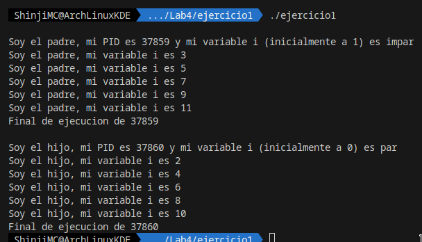
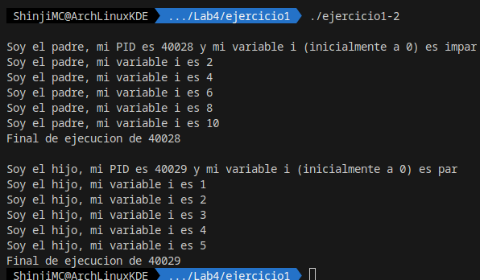
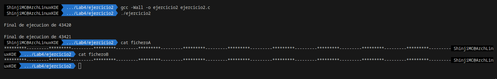
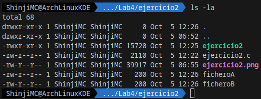
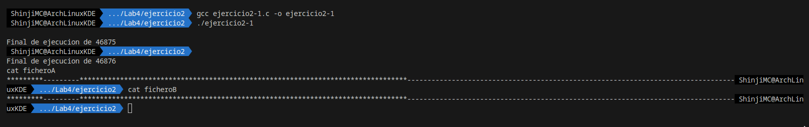

# Practice 2 [ENG]

This repository contains 4 example programs written in C to illustrate basic concepts of processes and file manipulation in Linux. Below is a brief description of each of the programs and how to run them.

## Exercise 1: `ejercicio1.c`

This program creates two processes, a parent and a child, and demonstrates how variables in both processes are independent of each other. The parent and child processes perform increment operations on a variable `i` and print them to the standard output.

To compile and run the program:

```bash
gcc ejercicio1.c -o ejercicio1
./ejercicio1
```



__Are the integer variables "i" and "j" in the parent process the same as those in the child process?__

No, because the variables for the parent and child processes are not the same due to the fact that each one has copies of the declarations of "i" and "j." Each process reserves memory to give values to "i" as 1 or 0 and "j" as 0, with separate memory between processes.

### Exercise 1.1: `ejercicio1-2.c`
We modify the code of "exercise1.c" so that both processes start with a variable "i" with the same value, but one increments it by one, and the other increments it by two.

```c
i++;//remove this line from line 18
```

```bash
gcc ejercicio1-2.c -o ejercicio1-2
./ejercicio1-2
```


## Exercise 2: `ejercicio2.c`
This program creates two files named "fileA" and "fileB" and two processes, again a parent and a child. Each process writes alternately the strings "*********" and "---------" to the files.

To compile and run the program:
```bash
gcc -Wall -o exercise2 exercise2.c
./exercise2
cat ficheroA
cat ficheroB
```



__What does the expression "fd1 = creat("fileA", 0666)" do? What does the constant "0666" mean? What permissions do the two files, "fileA" and "fileB," have after the execution of "exercise2.c"?__

The variable fd1 becomes a descriptor, which is initialized with creat. It specifies the name of the file to create or open and with the code 0666, it grants read and write permissions for all users. Both files have read and write permissions only, and you can check it by running:

```bash
ls -la
```


### Exercise 2.1: `ejercicio2-1.c`
The concurrent execution of writes by the parent and child processes results in the strings "*********" and "---------" being alternated in the resulting files. We modify exercise2.c to use the sleep() function to reduce the frequency at which the child process writes to the files compared to the parent process, i.e., perform fewer writes per unit of time.
```c
usleep(200000); //in line 22
usleep(1000); //in line 29
```
To compile and run the program:
```bash
gcc -Wall -o ejercicio2-1 ejercicio2-1.c
./ejercicio2-1
cat fileA
cat fileB
```


By making these changes, setting the child process to sleep for 0.2 seconds and the parent for 0.001 seconds, the waiting time to exit the process is modified. This means that while the process is active, the for loop will be running, resulting in more strings of "*********" or "---------." However, both files will have the same content; the only difference is the number of characters per string entered between `ejercicio2-1.c` and `ejercicio2.c`.

---

# Practica 2 [ESP]

Este repositorio contiene 4 programas de ejemplo escritos en C para ilustrar conceptos básicos de procesos y manipulación de archivos en Linux. A continuación, se proporciona una breve descripción de cada uno de los programas y cómo ejecutarlos.

## Ejercicio 1: `ejercicio1.c`

Este programa crea dos procesos, un padre y un hijo, y muestra cómo las variables en ambos procesos son independientes entre sí. El proceso padre e hijo realizan operaciones de incremento en una variable `i` y las imprimen en la salida estándar.

Para compilar y ejecutar el programa:

```bash
gcc ejercicio1.c -o ejercicio1
./ejercicio1
```


__¿Son las variables enteras “i” y “j” del proceso padre las mismas que las del proceso hijo?__

No, porque las variables para el proceso padre e hijo no son las mismas por el hecho de que cada uno tiene copias de las declaraciones de ”i” y ”j”. Por lo que cada proceso reserva memoria para darle los valores a ”i” de 1 o 0 y de ”j” de darle un valor de 0, siendo memoria separada entre procesos.

### Ejercicio 1.1: `ejercicio1-2.c`

Modificamos el código de “ejercicio1.c” para que ambos procesos inicien de una variable “i” con igual valor, pero uno la incremente de uno en uno y el otro de dos en dos.

```c
i++;//elimina esta linea de la linea 18
```

```bash
gcc ejercicio1-2.c -o ejercicio1-2
./ejercicio1-2
```


## Ejercicio 2: `ejercicio2.c`

Este programa crea dos archivos llamados "ficheroA" y "ficheroB" y dos procesos, nuevamente un padre y un hijo. Cada proceso escribe alternativamente las cadenas "*********" y "---------" en los archivos.

Para compilar y ejecutar el programa:
```bash
gcc -Wall -o ejercicio2 ejercicio2.c
./ejercicio2
cat ficheroA
cat ficheroB
```


__La expresión “fd1 = creat(“ficheroA”, 0666)” que está realizando?¿Qué significado tiene la constante “0666”? ¿Qué permisos tienen los dos ficheros, “ficheroA” y “ficheroB”, tras la ejecución del “ejercicio2.c”?__

La variable **fd1** al realizar ese proceso se converte en un decriptor, que es inicializado con creat. Indicandole el nombre del archivo a crear o abrir y con el codigo **0666** que el el permiso a otorgar que en este caso es lectura y escritura para todos los usuarios. Los dos ficheros solo tienen permiso de escritura y lectura, y lo podemos comprobar ejecutando:
```bash
ls -la
```


### Ejercicio 2.1: `ejercicio2-1.c`

La ejecución concurrente de las escrituras de los procesos padre e hijo da lugar a que las cadenas “*********“ y “————-“ las cuales están alternadas en los ficheros resultantes. Modificamos `ejercicio2.c` para que, mediante la utilización de la función “sleep()”, la frecuencia a la que el proceso hijo escribe en los ficheros sea menor que la del proceso padre, es decir, que realice menos escrituras por unidad de tiempo.

```c
usleep(200000); //in line 22
usleep(1000); //in line 29
```

Para compilar y ejecutar el programa:

```bash
gcc -Wall -o ejercicio2-1 ejercicio2-1.c
./ejercicio2-1
cat ficheroA
cat ficheroB
```


Al realizar los cambios de colocarle al proceso hijo el tiempo de 0.2 segundos y al padre 0.001, nos modifica el tiempo de espera para abandonar el proceso, es decir que mientras estemos en el proceso el bucle for estara funcionando escribiendo más cadenas de “*********“ o “————-“. Pero en ambos ficheros estará el mismo contenido, lo único que lo diferencia es la cantidad de caracteres por cadena que se ingresaron entre `ejercicio2-1.c` y el `ejercicio2.c`.