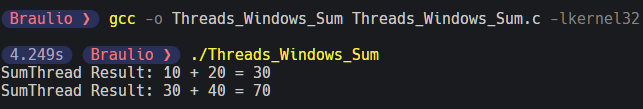
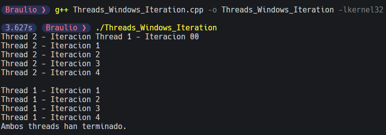

## Exercise 1: `Threads_Windows_Sum.c`

To compile and run the program:

```bash
gcc -o Threads_Windows_Sum Threads_Windows_Sum.c -lkernel32
./Threads_Windows_Sum
```



## Exercise 2: `Threads_Windows_Iteration.cpp`

To compile and run the program:

```bash
g++ Threads_Windows_Iteration.cpp -o Threads_Windows_Iteration -lkernel32
./Threads_Windows_Iteration
```


